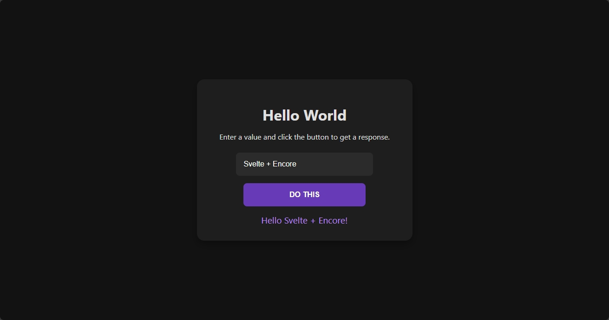

<h1 align="center">🥪 sveltekit-encore 🥪</h1>
<h2 align="center">Fullstack Monorepo Starter with Bun + SvelteKit + Encore.ts</h2>

<p align="center">

</p>

> [!NOTE]
>
> **sveltekit-encore** is a modern fullstack monorepo starter featuring seamless integration between SvelteKit frontend and Encore.ts backend. Leveraging Bun's speed and Prettier for consistent formatting, it provides an optimized development experience with hot-reloading for both ends.

## 🌟 Features

> **sveltekit-encore** comes batteries included:

- **Bun-Powered Monorepo** - Blazing fast development with Bun runtime
- **Type-Safe APIs** - Encore.ts backend with automatic validation
- **SvelteKit Frontend** - Modern reactive UI framework
- **Seamless Integration** - Auto-generated API client for frontend
- **Pre-configured Tooling** - Prettier formatting & concurrent execution
- **Production Ready** - Built-in build scripts for deployment

## 💻 Installation

###### Clone and install dependencies

```bash
git clone https://github.com/ArnavK-09/sveltekit-encore.git
cd sveltekit-encore
bun install
```

## 🛠️ MonoRepo Commands

```json
{
  "scripts": {
    "backend": "Start backend dev server",
    "backend:gen": "Generate frontend API client",
    "frontend": "Start SvelteKit dev server",
    "frontend:build": "Build production frontend",
    "dev": "Run both servers simultaneously",
    "boot": "Concurrent dev server execution",
    "fmt": "Format code with Prettier"
  }
}
```

###### Start development servers
```bash
bun run dev  # Or use 'bun run boot' for windows
```

## 🧠 Encore.ts Backend

### Core Concepts
- Type-safe API endpoints with built-in validation
- Async handlers with typed request/response interfaces
- Automatic OpenAPI schema generation
- Path/Query/Header parameter mapping

###### Example Endpoint
```typescript
import { api } from "encore.dev/api";

interface Params { name: string }
interface Response { message: string }

export const hello = api(
  { method: "GET", path: "/hello/:name" },
  async ({ name }: Params): Promise<Response> => {
    return { message: `Hello ${name}!` };
  }
);
```

## 🖥️ Frontend Integration

###### SvelteKit API Call Example
```svelte
<script lang="ts">
import { client } from "$lib/client";

let input = "";
let message = "";

const fetchData = async () => {
  const res = await client.hello.get(input);
  message = res.message;
};
</script>

<input bind:value={input}>
<button on:click={fetchData}>Submit</button>
<p>{message}</p>
```

## 📷 UI Preview

| Preview |
|------------------|
|  |

---

## 💻 Contributing

> [!TIP]
> Contributions welcome! Follow standard GitHub workflow:

1. **Fork & Clone** the repository
2. Create a feature branch: `git checkout -b feat/awesome`
3. Commit changes: `git commit -m "feat: awesome feature"`
4. Push & Open PR

## 👤 Author

<table>
<tbody>
<tr>
<td align="center"><a href="https://github.com/ArnavK-09">

<br/><b>Arnav K</b></a></td>
</tr>
</tbody>
</table>

---

<h2 align="center">📄 License</h2>

<p align="center">
<strong>sveltekit-encore</strong> is released under the <a href="./LICENSE">MIT</a>
</p>

---

<p align="center">
<strong>🌟 Found this useful? Give the repo a star to support its development! 🌟</strong>
</p>
